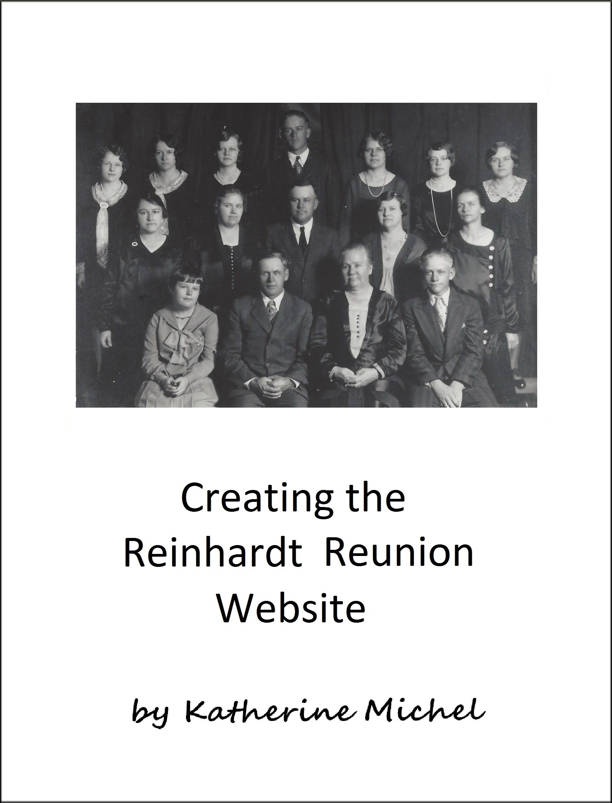

# Creating the Reinhardt Reunion Website

A GitBook Documenting My Experience of Creating the Reinhardt Reunion Website

Table of Contents
* [About](README.md)
* [Introduction](introduction.md)

* [Design Sprint](design-sprint/design-sprint.md)
   * [Flow Diagram](design-sprint/flow-diagram-rough-draft.md)
   * [Wireframes](design-sprint/wireframes.md)
   * [High-Fidelity Prototype](design-sprint/high-fidelity-prototype.md)

* [Coding](coding/coding.md)
   * [Design](coding/design.md)
   * [Django](coding/django.md)
   * [Staged Deployment](coding/staged-deployment.md)
   * [Administration](administration.md)

* [Accessibility](design-sprint/accessibility.md)

* [Lessons Learned](lessons-learned.md)

GitBook: http://katherinemichel.gitbooks.io/creating-the-reinhardt-reunion-website/content/
  
GitHub Repo: https://github.com/KatherineMichel/creating-the-reinhardt-reunion-website

© [Katherine Michel](http://katherinemichel.github.io) 2016
