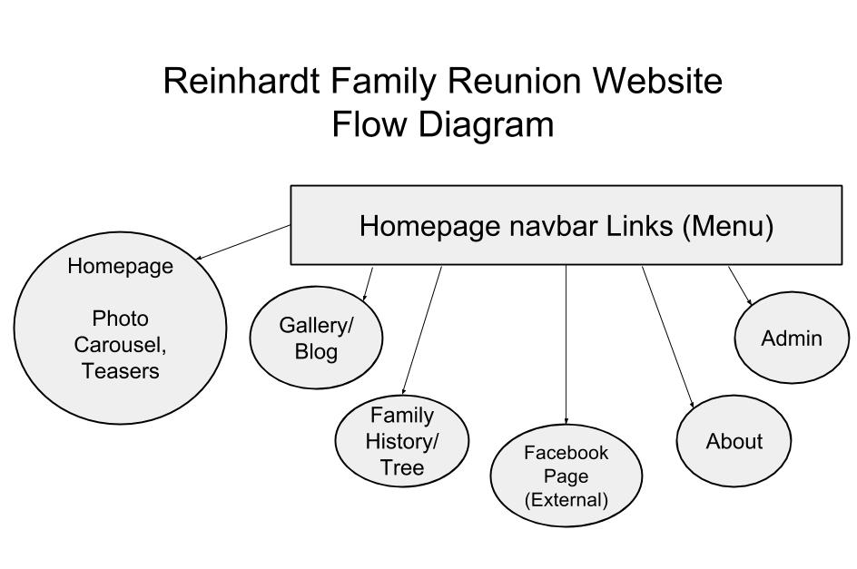
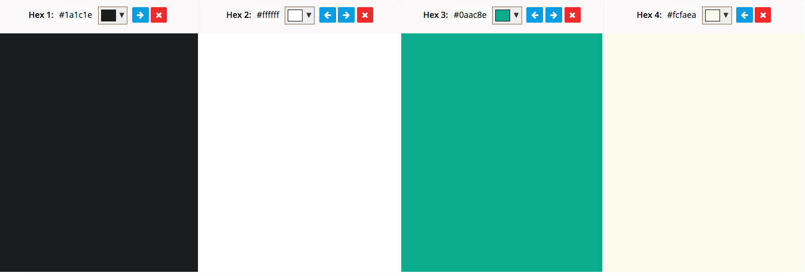

# Flow Diagram Rough Draft

Website flow diagram made using [Google Drawings](https://en.wikipedia.org/wiki/Google_Drawings)

## Carousel Photos

Photo 1

Photo 2

Photo 3

## Color Scheme

The website color scheme passes the [WebAim Color Contrast Checker](http://webaim.org/resources/contrastchecker) with a contrast ratio of 17.09:1.

* Background color: #1a1c1e
* Foreground color: #ffffff
* Accent color: #0aac8e

